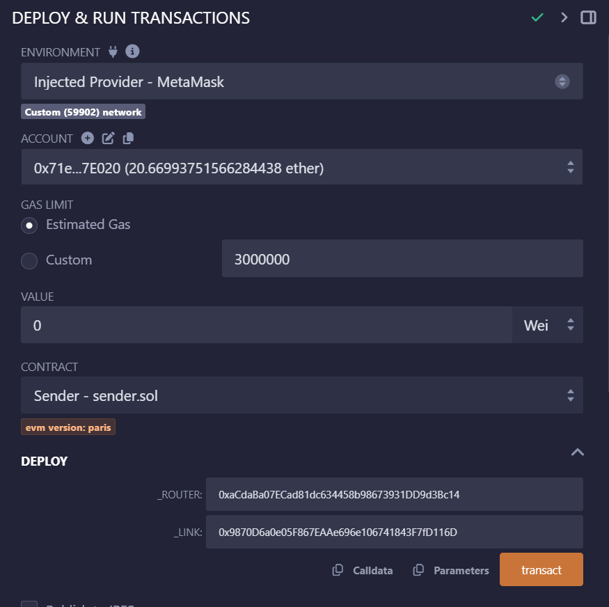
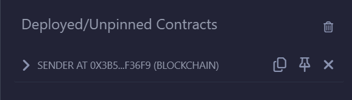
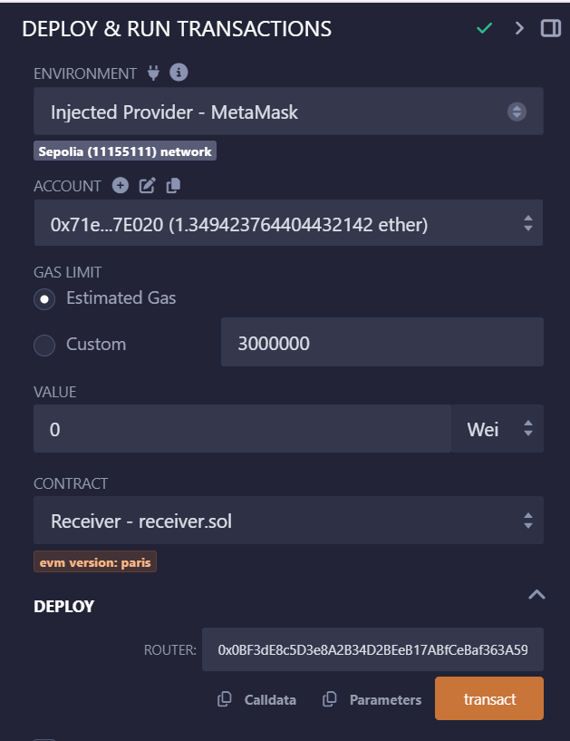
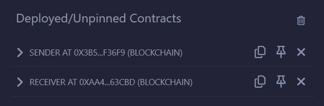
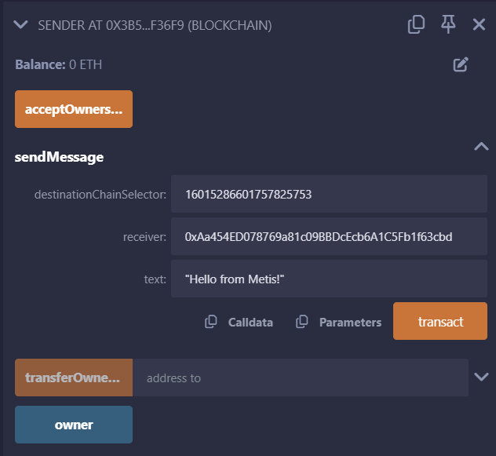
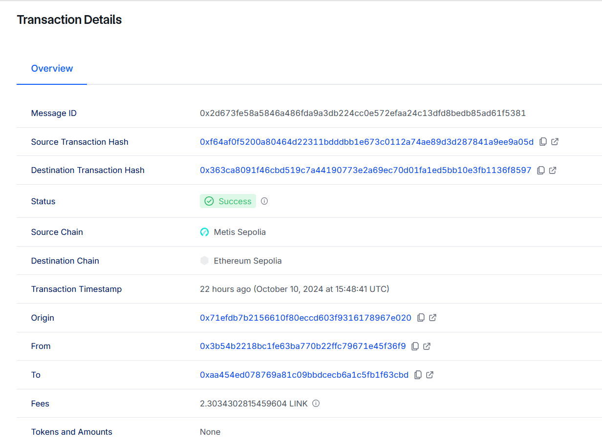
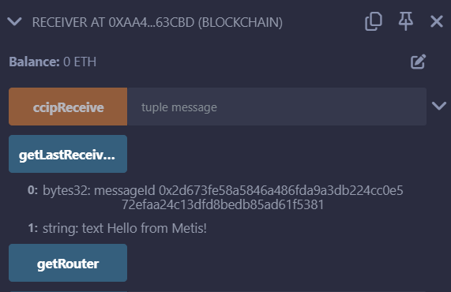

# Cross-Chain Data Transfer with Chainlink CCIP

This project demonstrates how to send data across blockchains using Chainlink Cross-Chain Interoperability Protocol (CCIP). Specifically, it allows you to transfer data between smart contracts deployed on the Metis network and the Ethereum Sepolia testnet. The project includes a `Sender.sol` contract on Metis and a `Receiver.sol` contract on Ethereum Sepolia, and uses Chainlink CCIP to facilitate secure cross-chain communication.

## Prerequisites

### Tools

- Familiarity with the following tools is assumed:
  - Solidity Programming Language
  - MetaMask Wallet
  - Remix IDE

### Required Testnet Assets

Before proceeding, ensure that you have testnet tokens to cover transaction and CCIP fees:

- **Metis Testnet (sepolia)**:

  - Obtain testnet METIS tokens from the [Metis Sepolia Faucet](https://faucet.metis.io/).
  - Obtain testnet LINK tokens from [Chainlink Faucets](https://faucets.chain.link/).

- **Ethereum Sepolia**:
  - Obtain testnet ETH from [Sepolia Faucet](https://sepoliafaucet.com/).
  - Obtain testnet LINK tokens from [Chainlink Faucets](https://faucets.chain.link/).

# Deployment Guide

## Step 1: Deploy the Sender Contract on Metis Sepolia

To see a detailed explanation of this contract, read the [Code Explanation](#smart-contract-overview) section.

1. **Open Sender.sol in Remix:**

   - Navigate to the `Sender.sol` contract inside your project folder.
   - Open [Remix IDE](https://remix.ethereum.org/). 
   - Load the contract into Remix.

2. **Compile the Contract:**

   - Ensure the Solidity version is set to `0.8.19`.
   - Compile the contract without errors.

3. **Deploy the Contract:**

   - Connect your MetaMask wallet and select the Metis sepolia testnet.
   - Under the **Deploy & Run Transactions** tab, choose the `Injected Provider - MetaMask` environment.
   - Under the Deploy section, enter the Metis sepolia CCIP Router address and LINK token contract address:
   - You can find both of these addresses on the [Supported Networks](https://docs.chain.link/ccip/supported-networks) page. The LINK token contract address is also listed on the [LINK Token Contracts](https://docs.chain.link/resources/link-token-contracts) page
     - **Metis sepolia Router Address:** `0xaCdaBa07ECad81dc634458b98673931DD9d3Bc14`
     - **Metis sepolia LINK Address:** `0x9870D6a0e05F867EAAe696e106741843F7fD116D`
     
   - Click the transact button to deploy the contract. MetaMask prompts you to confirm the transaction. Check the transaction details to make sure you are deploying the contract to Metis Sepolia.
   - After you confirm the transaction, copy the contract address from Deployed Contracts list.
    

4. **Fund the Contract with LINK:**
   - After deployment, copy the deployed contract address.
   - Transfer 5 LINK to the sender contract using MetaMask to cover CCIP fees.

---

## Step 2: Deploy the Receiver Contract on Ethereum Sepolia

To see a detailed explanation of this contract, read the [Code Explanation](#smart-contract-overview) section.

1. **Open Receiver.sol in Remix:**

   - Load the `Receiver.sol` contract into Remix IDE.

2. **Compile the Contract:**

   - Ensure the Solidity version is set to `0.8.19`.
   - Compile the contract without errors.

3. **Deploy the Contract:**
   - Connect your MetaMask wallet and select the Ethereum Sepolia testnet.
   - Under the **Deploy & Run Transactions** tab, make sure the Environment is still set to Injected Provider - MetaMask.
   - Enter the Ethereum Sepolia CCIP Router address:
     - **Sepolia Router Address:** `0x0BF3dE8c5D3e8A2B34D2BEeB17ABfCeBaf363A59`
   - You can find the addresses for each network on the [Supported Networks](https://docs.chain.link/ccip/supported-networks) page.
   - Click Deploy and confirm the transaction in MetaMask.
   
   

   - After you confirm the transaction, the contract address appears as the second item in the Deployed Contracts list. Copy this contract address.

    

---
You now have one sender contract on Metis Sepolia and one receiver contract on Ethereum Sepolia. You sent 5 LINK to the sender contract to pay the CCIP fees. Next, send data from the sender contract to the receiver contract.

---

## Step 3: Sending Data Between Chains

1. **Prepare the Data Transfer:**

   - Open MetaMask and switch to the Metis sepolia network.
   - In Remix, expand the `sendMessage` function of the deployed sender contract.

2. **Input Parameters:**

   - `destinationChainSelector`: Enter the chain selector for Ethereum Sepolia (`16015286601757825753`).
   - `receiver`: Enter the deployed receiver contract address on Ethereum Sepolia.
   - `text`: Enter the string you want to send (e.g., `"Hello World!"`).

      

3. **Send the Message:**
   - Click Transact to send the message from Metis to Ethereum Sepolia.
   - Confirm the transaction in MetaMask.

---

## Step 4: Confirm the Data Transfer

1. **Verify on CCIP Explorer:**

   - Copy the transaction hash and visit the [CCIP Explorer](https://ccip.chain.link/).
   - Paste the transaction hash to monitor the status of the cross-chain message.
   - When the status of the transaction is marked with a "Success" status, the CCIP transaction and the destination transaction are complete.

It usually takes around 30 minutes to complete transactin please have some patience!

2. **Read Data on Ethereum Sepolia:**
   - Switch to the Ethereum Sepolia network in MetaMask.
   - In Remix, expand the deployed receiver contract and click the `getLastReceivedMessageDetails` function.
   - The data sent from Metis should now be stored and displayed (e.g., `"Hello from Metis!"`).

Congratulations! You just sent your first cross-chain data using CCIP. Next, examine the Smart Contract Overview to learn how this contract works.

---

## Smart Contract Overview

### Sender Contract (`Sender.sol`)

The `Sender.sol` contract enables cross-chain data transfer using Chainlink’s CCIP. It manages LINK tokens to pay for the transmission fees and interfaces with the CCIP router to send messages between blockchains.

#### Initialization

During deployment, you specify:

- **Router Address:** Provides access to CCIP functions like fee estimation and sending cross-chain messages.
- **LINK Token Address:** Used for paying the CCIP message fees.

The router address provides functions that are required for this example:
  - The getFee [function](https://docs.chain.link/ccip/api-reference/i-router-client#getfee) to estimate the CCIP fees.
  - The ccipSend [function](https://docs.chain.link/ccip/api-reference/i-router-client#ccipsend) to send CCIP messages.

#### Main Functionality: `sendMessage`

The core functionality of the `Sender.sol` contract is implemented in the `sendMessage` function. This function performs several operations to construct and send a cross-chain message:

1. **Constructing the Message:**
    - The message is constructed using the `EVM2AnyMessage` [struct](https://docs.chain.link/ccip/api-reference/client#evm2anymessage) provided by CCIP. This structure contains the necessary information to relay the message to the destination chain:
    
      - **Receiver Address Encoding:** Since the destination chain may use a different address format (especially if it's not EVM-compatible), the receiver’s address is encoded into bytes using `abi.encode` to ensure compatibility.
        
      - **Data Encoding:** The string data you want to send is also encoded into bytes using `abi.encode`, making it suitable for transmission across chains.
        
      - **Token Amounts:** In this example, the contract does not send tokens along with the message, so the `tokenAmounts` array remains empty.
        
      - **Gas Limit and Extra Arguments:** The function includes a gas limit (200,000 in this example) for executing the message on the destination blockchain. Additional arguments are configured through `extraArgs`, including an option to allow messages to be executed out-of-order relative to other messages sent from the same source.

2. **Fee Estimation:**
    - The contract estimates the cost of sending the cross-chain message by calling the `getFee` function of the router. This function calculates the required fee based on the message’s destination, size, and other parameters.

3. **LINK Token Management:**
    - After estimating the fees, the contract checks its balance to ensure it holds enough LINK tokens to cover the cross-chain fees. If sufficient LINK is available, the contract grants the router permission to withdraw the necessary amount of LINK tokens to pay for the message transmission.

This contract simplifies cross-chain communication by handling message encoding, fee management, and secure transmission via Chainlink CCIP.

### Receiver Contract (`Receiver.sol`)

The `Receiver.sol` contract receives data from the sender via CCIP. It stores the last received message and emits an event.

**Key functions:**

- `_ccipReceive`: Internal function that handles the reception of the message and decodes it.
- `getLastReceivedMessageDetails`: Public function that returns the details of the last received message.

---

## Best Practices

- **Gas Management:** Ensure that the gas limit is properly set for cross-chain transactions. In the example, the gas limit for callback on the destination chain is set to 200,000.
- **Extra Arguments:** Make sure to handle `extraArgs` off-chain or through updatable storage variables for flexibility.
- **Router Validation:** Always validate that the destination chain and router are supported for secure cross-chain communication.

---

## Troubleshooting

- **Transaction Failures:** Ensure you have sufficient LINK tokens to cover CCIP fees.
- **Gas Spikes:** If experiencing transaction failures due to gas price spikes on Sepolia, add additional LINK tokens or switch to a different testnet.
